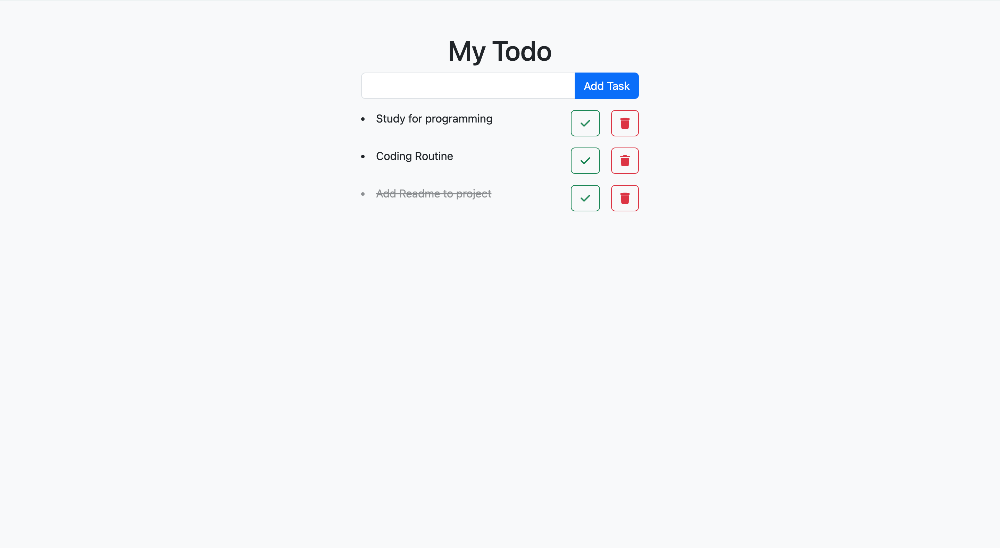

# TodoApp With Bootstrap

This application built by HTML5, CSS3 and javaScript.Aldo I used Bootstrap5 frontend framework.

## Table of contents

- [Overview](#overview)
  - [Screenshot](#screenshot)
  - [Links](#links)
- [My process](#my-process)
  - [Built with](#built-with)
  - [What I learned](#what-i-learned)
  - [Continued development](#continued-development)
  - [Useful resources](#useful-resources)
- [Author](#author)

## Overview

### Screenshot



### Links

- [Live Site](https://morcicek.github.io/TodoApp-With-Bootstrap/)

## My process

### Built with

- Semantic HTML5 markup
- CSS custom properties
- Vanilla Javascript
- [Bootstrap](https://getbootstrap.com/) - CSS Framework

### What I learned

I learned some classes in bootstrap.Also the project is so useful for reinforcing some knowledge.

```html
<h1 class="mt-5 ml-1 text-center">My Todo</h1>
```

```css
.btn {
  margin-left: 1rem;
}
```

```js
doneBtn.addEventListener('click', () => {
  li.classList.add('text-decoration-line-through', 'list');
});
```

### Continued development

I still keep study about JavaScript advanced concepts like Object-Oriented Programming(OOS) and fetching data from server.

## Author

- Linkedin - [Mehmet Cevat Morcicek](https://www.linkedin.com/in/mehmet-cevat-morcicek-b50a29178/)
- Twitter - [@morcicek_m](https://twitter.com/morcicek_m)
